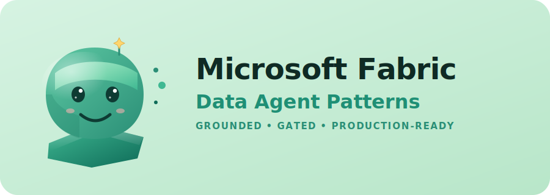

<h1 align="center">Patterns for Microsoft Fabric Data Agents</h1>

<p align="center">
  
</p>

---

Repeatable, **gated** patterns for shipping Microsoft Fabric Data Agents on enterprise tenants. Each pattern ships with a playbook, drop-in assets, a one-page Go / No-Go checklist, and a CI-runnable score gate that catches ungrounded answers before they reach users.

> **New here?** Start with the [**Quickstart**](./QUICKSTART.md) — a step-by-step that walks you through the exact end-to-end we ran (workspace creation, synthetic data, model deploy, agent publish, score gate, capacity pause) in ~60 minutes.

> **Why this repo exists.** Most Fabric Data Agent demos look great on a synthetic dataset and quietly fall apart on real semantic models — wrong audience tokens, consolidated run endpoints that bypass grounding, and "10/10 pass" scores that are actually polite deflections. These patterns are the result of taking one end-to-end and writing down everything that wasn't in the docs.

---

## Hero architecture

```mermaid
flowchart LR
    subgraph SRC[Sources]
        S1[(OLTP / ERP / CRM)]
        S2[(Files / APIs)]
    end

    subgraph FAB[Microsoft Fabric Workspace]
        LH[Lakehouse<br/>Delta tables]
        SM[Semantic Model<br/>TMDL · measures · synonyms · descriptions]
        BPA{{BPA Gate<br/>Best Practice Analyzer}}
        AGT[Data Agent<br/>published]
    end

    subgraph CI[CI / Quality Gate]
        SCORE{{Score Gate<br/>10 grounded Qs · &ge;80%<br/>ungrounded-deflection guard}}
        REPORT[[agent-score-report.md]]
    end

    subgraph CONSUMERS[Consumers]
        C1[Copilot in Fabric]
        C2[Teams / web app]
        C3[Custom apps via OpenAI-compatible API]
    end

    S1 --> LH
    S2 --> LH
    LH --> SM
    SM --> BPA
    BPA -->|pass| AGT
    AGT --> SCORE
    SCORE --> REPORT
    REPORT -->|gate pass| CONSUMERS
    SCORE -. fail .-> SM

    classDef gate fill:#fde68a,stroke:#b45309,color:#111
    classDef store fill:#dbeafe,stroke:#1e40af,color:#111
    classDef agent fill:#dcfce7,stroke:#166534,color:#111
    class BPA,SCORE gate
    class LH,SM store
    class AGT agent
```



The two gates (BPA + Score) are what turn "an agent that answered something" into "an agent you can put in front of a business user."

---

## Patterns

| # | Pattern | Status | What you get |
|---|---------|--------|--------------|
| 01 | [Fabric Data Agent — Semantic Readiness](./patterns/01-fabric-data-agent-semantic-readiness/) | **MVP — validated 9/10** | Synthetic CPG dataset, semantic model with rich metadata, BPA + score gates, working OpenAI-compatible client |
| 02 | Synapse / ADF / SQL → Fabric Migration | Planned | — |

---

## Vertical examples

The semantic-readiness pattern is domain-agnostic. Each folder below adapts it to a vertical with a sample data model, ten grounded business questions, and candidate measures.

| Vertical | Focus | Folder |
|---|---|---|
| CPG / Manufacturing | NSV, MAT, OEE, OTIF, market mix | [verticals/cpg-manufacturing](./patterns/01-fabric-data-agent-semantic-readiness/verticals/cpg-manufacturing/) |
| Financial Services | Credit risk, exposure, PD/LGD, fee yield | [verticals/fsi](./patterns/01-fabric-data-agent-semantic-readiness/verticals/fsi/) |
| Healthcare | Claims, denials, LOS, readmissions | [verticals/healthcare](./patterns/01-fabric-data-agent-semantic-readiness/verticals/healthcare/) |
| Energy / Utilities | Asset performance, downtime, generation | [verticals/energy](./patterns/01-fabric-data-agent-semantic-readiness/verticals/energy/) |
| Public Sector | Citizen services, case backlog, SLA | [verticals/public-sector](./patterns/01-fabric-data-agent-semantic-readiness/verticals/public-sector/) |
| Telco | Network KPIs, churn, ARPU | [verticals/telco](./patterns/01-fabric-data-agent-semantic-readiness/verticals/telco/) |

---

## How to use this repo

1. Read the [Quickstart](./QUICKSTART.md) for the end-to-end walkthrough.
2. Pick a pattern under [`patterns/`](./patterns/).
3. Read its `README.md` (when to use / not to use).
4. Run `checklist.md` to decide Go / No-Go.
5. Execute `playbook.md` step by step.
6. Use everything under `assets/` as drop-in artifacts.
7. Gate with `assets/score-agent.ps1` — commit the report.

## Repo layout

```
patterns/<id>-<name>/
  README.md         when to use / not to use / outcome
  prerequisites.md  tenant, identity, licenses, tools
  playbook.md       numbered, executable steps
  checklist.md      one-page Go/No-Go
  assets/           drop-in artifacts (scripts, configs, samples)
  examples/         anonymized real-run outputs and story
  verticals/        domain adaptations
```

## Two gotchas that cost the most time

Captured in [`patterns/01-…/examples/story.md`](./patterns/01-fabric-data-agent-semantic-readiness/examples/story.md):

1. **Token audience matters even when auth succeeds.** The Fabric Data Agent OpenAI gateway is hosted under `api.fabric.microsoft.com`, but it requires a token for the **Power BI** workload audience (`https://analysis.windows.net/powerbi/api`). The fabric audience token authenticates fine — and then silently bypasses grounding.
2. **The multi-step run flow grounds; the consolidated one doesn't.** Use `POST /threads` → `POST /threads/{tid}/messages` → `POST /threads/{tid}/runs` → poll `GET /threads/{tid}/messages?run_id=…`. The single-call `POST /threads/runs` will return polite English that never touched your semantic model.

## License

MIT — see [LICENSE](./LICENSE).
