<h1 align="center">Patterns for Microsoft Fabric Data Agents</h1>

<p align="center">
  
</p>

---

Repeatable, **gated** patterns for shipping Microsoft Fabric Data Agents on enterprise tenants. Each pattern ships with a playbook, drop-in assets, a one-page Go / No-Go checklist, and a CI-runnable score gate that catches ungrounded answers before they reach users.

> **New here?** Start with the [**Quickstart**](./QUICKSTART.md) — a step-by-step that walks you through the exact end-to-end we ran (workspace creation, synthetic data, model deploy, agent publish, score gate, capacity pause) in ~60 minutes.

> **Why this repo exists.** Most Fabric Data Agent demos look great on a synthetic dataset and quietly fall apart on real semantic models — wrong audience tokens, consolidated run endpoints that bypass grounding, and "10/10 pass" scores that are actually polite deflections. These patterns are the result of taking one end-to-end and writing down everything that wasn't in the docs.

---

## Worked business case — CPG manufacturer at quarter-end

**The setting.** A multi-brand consumer-goods manufacturer ships from four plants into six markets across three channels (modern trade, eCommerce, foodservice). The CFO needs a quarter-end commercial readout; the COO needs the same data sliced by plant and line; both have to be ready before the Monday review.

**The problem.** Today every answer is a PowerPoint. A BI analyst opens four reports, copies numbers into a deck, and ten hours later the leadership team gets a snapshot that's already stale. Questions phrased slightly differently in the meeting ("what's MAT for our top brand?" vs. "12-month volume on Brand Y") trigger another round of analyst work. The reports exist; the language layer between business questions and the data is missing.

**The outcome we shipped.** A single Fabric Data Agent over a deliberately authored semantic model — descriptions on every visible object, synonyms on every dimension attribute, explicit DAX measures for every KPI — answering both commercial (NSV, NSV YoY, MAT volume) and operational (OEE, OTIF, downtime hours, days of supply, scrap %) questions directly in chat, with real numbers reconciling to the warehouse. A scripted score gate verifies grounding on every model change before the agent reaches a user.

**What changed for the business:** the Monday readout is a conversation, not a deck. Anyone who can ask a question can self-serve. The CoE owns one artifact — the semantic model — and the agent is a thin, automatically-gated consumer of it.

---

## Technical architecture

How the Microsoft Fabric pieces fit together for this case:

```mermaid
flowchart LR
    subgraph SRC[Source systems]
        ERP[(SAP / ERP<br/>orders, shipments)]
        MES[(MES / plant historian<br/>production, downtime)]
        CRM[(CRM / TPM<br/>customers, promos)]
    end

    subgraph FAB[Microsoft Fabric workspace · F-SKU capacity]
        direction TB
        LH[(OneLake Lakehouse<br/><b>Delta tables</b><br/>fact_sales_orders · fact_production<br/>fact_inventory · dim_market · dim_product<br/>dim_plant · dim_date)]
        SM[Semantic Model<br/><b>DirectLake · TMDL</b><br/>descriptions · synonyms<br/>18 explicit DAX measures<br/>NSV · NSV YoY · MAT Volume<br/>OEE · OTIF · Days of Supply · Scrap %]
        BPA{{BPA gate<br/>Best Practice Analyzer<br/>descriptions · synonyms<br/>explicit measures · hidden cols}}
        AGT[<b>Fabric Data Agent</b><br/>instructions · example Qs<br/>OpenAI-compatible Assistants v2<br/>thread · message · run]
    end

    subgraph CI[Quality gate · CI]
        SCORE{{score-agent.ps1<br/>10 grounded business Qs<br/>&ge; 80% pass · ungrounded-deflection guard}}
        REPORT[[agent-score-report.md<br/>committed per run]]
    end

    subgraph CONS[Business consumers]
        CFO[CFO · commercial readout]
        COO[COO · plant performance]
        COPILOT[Copilot in Fabric / Teams]
        APP[Custom apps via OpenAI SDK]
    end

    ERP --> LH
    MES --> LH
    CRM --> LH
    LH -- DirectLake --> SM
    SM --> BPA
    BPA -->|pass| AGT
    AGT --> SCORE
    SCORE --> REPORT
    REPORT -->|gate pass| COPILOT
    COPILOT --> CFO
    COPILOT --> COO
    AGT --> APP
    SCORE -. fail .-> SM

    classDef gate fill:#fde68a,stroke:#b45309,color:#111
    classDef store fill:#dbeafe,stroke:#1e40af,color:#111
    classDef agent fill:#dcfce7,stroke:#166534,color:#111
    classDef src fill:#f3f4f6,stroke:#6b7280,color:#111
    class BPA,SCORE gate
    class LH,SM store
    class AGT agent
    class ERP,MES,CRM src
```



**Why each piece is here:**

| Component | Role | Why it matters |
|---|---|---|
| **OneLake Lakehouse** (Delta) | Single physical copy of fact and dim tables, loaded from ERP / MES / CRM | DirectLake lets the semantic model query Delta with no import/refresh lag |
| **Semantic model** (TMDL, DirectLake) | The *language* layer: descriptions, synonyms, explicit measures, marked date table | This is what the agent reads to understand the business — not the raw tables |
| **BPA gate** | Tabular Editor rules: every visible object has a description, every dim attribute has synonyms, no implicit aggregations | Catches the model defects that cause agents to hallucinate or deflect |
| **Fabric Data Agent** | OpenAI-compatible Assistants v2 surface, bound to the model with instructions + example Qs | Provides the chat interface; routes questions to the semantic model |
| **`score-agent.ps1`** | 10 grounded business questions, ≥ 80 % pass, ungrounded-deflection guard | Turns "the demo worked once" into a repeatable gate you can run in CI |
| **Consumers** | Copilot in Fabric / Teams; custom apps via OpenAI SDK against the same gateway | Same agent, multiple front-ends — no per-channel logic to maintain |

The two gates (BPA + Score) are what turn "an agent that answered something" into "an agent you can put in front of a business user."

---

## The 10 business questions — and what the agent actually answered

These are the exact questions in [`patterns/01-…/examples/questions.md`](./patterns/01-fabric-data-agent-semantic-readiness/examples/questions.md) and the grounded answers from the 9 / 10 PASS run in [`examples/agent-score-report.md`](./patterns/01-fabric-data-agent-semantic-readiness/examples/agent-score-report.md). Names like `Market_APAC2`, `Plant_D`, `Brand_Y`, `SKU_0022` are anonymized placeholders.

### Commercial

| # | Business question | Measure | Grounded answer |
|---|---|---|---|
| 1 | What was NSV last quarter? | `NSV QTD` | **$4,169,233** (Q2 2026, Apr 1 – May 31) |
| 2 | Which market had the highest net sales value last year? | `NSV LY` | **Market_APAC2 — $5,150,343** (2025) |
| 3 | Show me year-over-year NSV growth by market. | `NSV YoY %` | Market_AM1 **+17.9 %**, Market_EU1 +15.9 %, Market_APAC1 +14.4 %, Market_APAC2 +9.9 %, Market_AM2 +7.6 %, Market_EU2 +4.1 % |
| 4 | What is the MAT volume in cases for our top brand? | `Volume Cases MAT` | **Brand_Y — 535,775 cases** |

### Operational

| # | Business question | Measure | Grounded answer |
|---|---|---|---|
| 5 | What is OEE by plant this month? | `OEE` | Plant_D **79.5 %**, Plant_A 76.8 %, Plant_B 70.5 %, Plant_C 57.6 % |
| 6 | How many downtime hours did we record last week by line? | `Downtime Hours` | Line_01 **13.7 h**, Line_02 12.1 h, Line_03 2.5 h |
| 7 | What is OTIF by trade channel month-to-date? | `OTIF %` | eCommerce **88.2 %**, Modern Trade 86.1 %, Wholesale 78.4 %, Traditional 76.9 %, Foodservice 64.5 % |
| 8 | What are days of supply by SKU in Market_EU1? | `Days of Supply` | SKU_0022 — **22.8 days** (top) |
| 9 | Which SKUs are trending down YoY in volume in Market_EU1? | `Volume Cases YoY %` | SKU_0028 **−40.7 %**, SKU_0015 −39.8 %, SKU_0027 −19.2 %, … |
| 10 | What is the scrap percentage by plant quarter-to-date? | `Scrap %` | Plant_D **2.6 %**, Plant_A 3.9 %, Plant_B 4.9 %, Plant_C 7.8 % |

All ten numbers reconcile against direct DAX evaluation of the semantic model. The single FAIL in the 9 / 10 was a keyword-matching issue on Q3 (agent said "year-over-year" instead of the literal `YoY`); the model was correct. Detail: [`examples/story.md`](./patterns/01-fabric-data-agent-semantic-readiness/examples/story.md).

---

## Patterns

| # | Pattern | Status | What you get |
|---|---------|--------|--------------|
| 01 | [Fabric Data Agent — Semantic Readiness](./patterns/01-fabric-data-agent-semantic-readiness/) | **MVP — validated 9/10** | Synthetic CPG dataset, semantic model with rich metadata, BPA + score gates, working OpenAI-compatible client |
| 02 | Synapse / ADF / SQL → Fabric Migration | Planned | — |

---

## Vertical examples

The semantic-readiness pattern is domain-agnostic. Each folder below adapts it to a vertical with a sample data model, ten grounded business questions, and candidate measures.

| Vertical | Focus | Folder |
|---|---|---|
| CPG / Manufacturing | NSV, MAT, OEE, OTIF, market mix | [verticals/cpg-manufacturing](./patterns/01-fabric-data-agent-semantic-readiness/verticals/cpg-manufacturing/) |
| Financial Services | Credit risk, exposure, PD/LGD, fee yield | [verticals/fsi](./patterns/01-fabric-data-agent-semantic-readiness/verticals/fsi/) |
| Healthcare | Claims, denials, LOS, readmissions | [verticals/healthcare](./patterns/01-fabric-data-agent-semantic-readiness/verticals/healthcare/) |
| Energy / Utilities | Asset performance, downtime, generation | [verticals/energy](./patterns/01-fabric-data-agent-semantic-readiness/verticals/energy/) |
| Public Sector | Citizen services, case backlog, SLA | [verticals/public-sector](./patterns/01-fabric-data-agent-semantic-readiness/verticals/public-sector/) |
| Telco | Network KPIs, churn, ARPU | [verticals/telco](./patterns/01-fabric-data-agent-semantic-readiness/verticals/telco/) |

---

## How to use this repo

1. Read the [Quickstart](./QUICKSTART.md) for the end-to-end walkthrough.
2. Pick a pattern under [`patterns/`](./patterns/).
3. Read its `README.md` (when to use / not to use).
4. Run `checklist.md` to decide Go / No-Go.
5. Execute `playbook.md` step by step.
6. Use everything under `assets/` as drop-in artifacts.
7. Gate with `assets/score-agent.ps1` — commit the report.

## Repo layout

```
patterns/<id>-<name>/
  README.md         when to use / not to use / outcome
  prerequisites.md  tenant, identity, licenses, tools
  playbook.md       numbered, executable steps
  checklist.md      one-page Go/No-Go
  assets/           drop-in artifacts (scripts, configs, samples)
  examples/         anonymized real-run outputs and story
  verticals/        domain adaptations
```

## Two gotchas that cost the most time

Captured in [`patterns/01-…/examples/story.md`](./patterns/01-fabric-data-agent-semantic-readiness/examples/story.md):

1. **Token audience matters even when auth succeeds.** The Fabric Data Agent OpenAI gateway is hosted under `api.fabric.microsoft.com`, but it requires a token for the **Power BI** workload audience (`https://analysis.windows.net/powerbi/api`). The fabric audience token authenticates fine — and then silently bypasses grounding.
2. **The multi-step run flow grounds; the consolidated one doesn't.** Use `POST /threads` → `POST /threads/{tid}/messages` → `POST /threads/{tid}/runs` → poll `GET /threads/{tid}/messages?run_id=…`. The single-call `POST /threads/runs` will return polite English that never touched your semantic model.

## License

MIT — see [LICENSE](./LICENSE).
